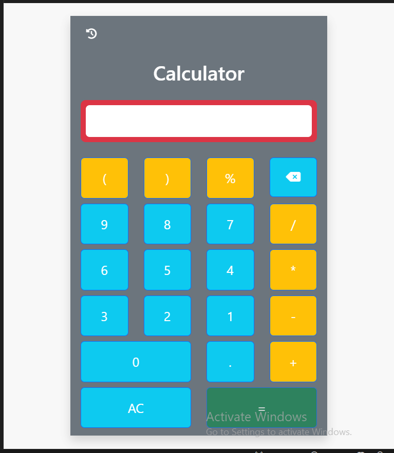

# Calculator Project

This is a simple calculator project built using HTML, CSS, and JavaScript. The calculator supports basic arithmetic operations and includes a history feature to keep track of previous calculations.

## Features

- Basic arithmetic operations: addition, subtraction, multiplication, and division.
- Percentage calculations.
- Parentheses for grouping expressions.
- History of previous calculations.
- Clear and backspace functionalities.

## Setup

1. Clone the repository or download the project files.
2. Open the `calculator.html` file in your web browser to use the calculator.

## File Structure

- `calculator.html`: The main HTML file containing the structure of the calculator.
- `style.css`: The CSS file for styling the calculator.
- `basic.js`: The JavaScript file containing the logic for the calculator.

## Usage

- Click on the number buttons to input numbers.
- Click on the operator buttons to perform operations.
- Use the `AC` button to clear all input.
- Use the backspace button to delete the last digit.
- Click the `=` button to evaluate the expression.
- Click the history button to view previous calculations.
- Click the delete button in the history panel to clear the history.

## Screenshots

## License

This project is licensed under the MIT License.
